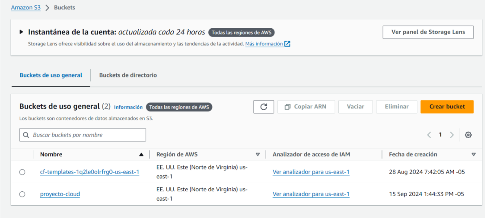
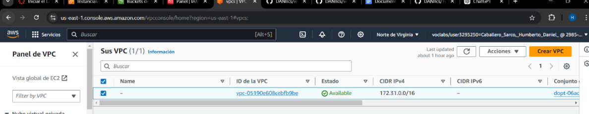
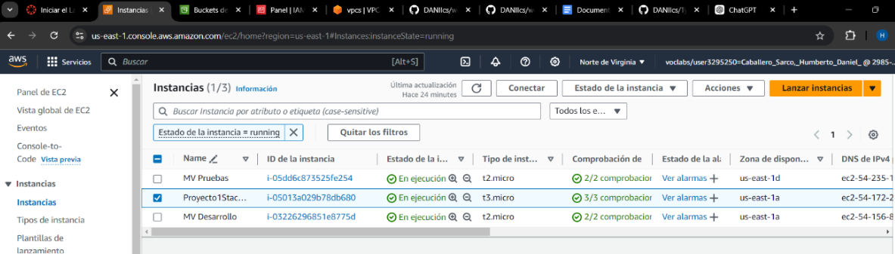
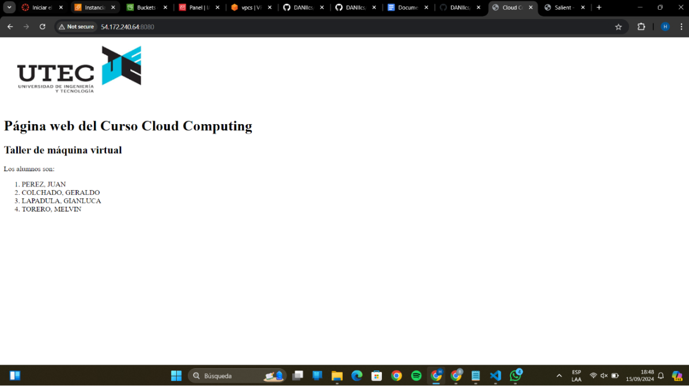
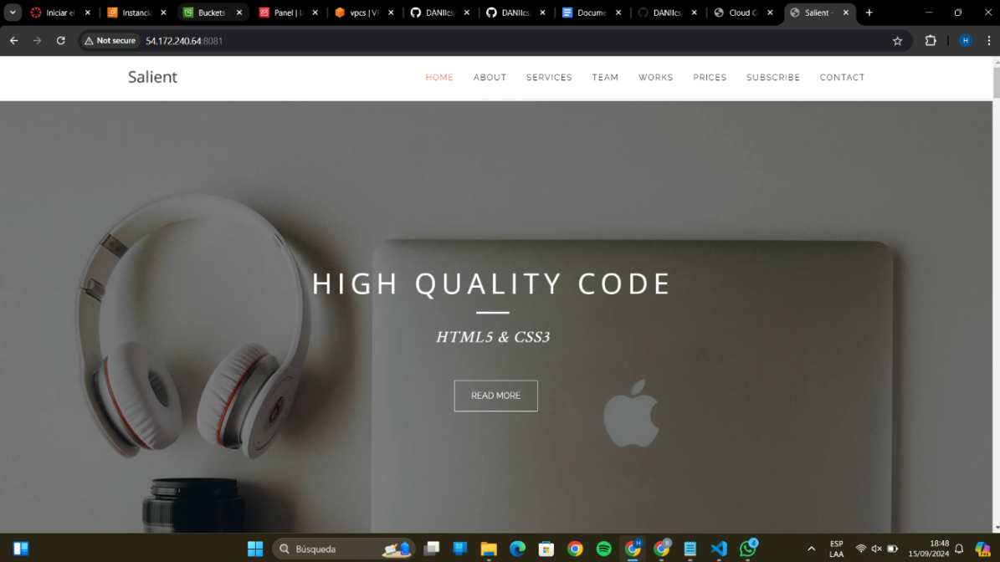

# Proyecto 1 de Cloud computing (typescript)

## Pasos a seguir:
inicializamos el aws

guadamos las credenciales en el directorio de .aws con el siguiente comando 

   ```bash
   notepad $env:USERPROFILE.aws\credentials

creamos un nuveo bucket 


buscamos nuestra id del AMI

buscamos tambien la id del panel VPC



Creamos un archivo en vs de typescript con los sigueintes comandos 

   ```bash
   npm install -g aws-cdk

   cdk init app --language typescript

Ajustamos el codigo de tal manera que utilice las credenciales y tenaga los roles establecudos para que pueda abirir los puertos 8080 y 8081

Usamos los siguietes comando para deployar

   ```bash
   aws ssm put-parameter --name "/cdk-bootstrap/hnb659fds/version" --type "String" --value "15" --overwrite

   cdk deploy

Comporbamos que se haya deployado una nueva instancia en nuestro ec2



Uilizamos el id de esta instancia y comprobamos con los puertos establecidos





